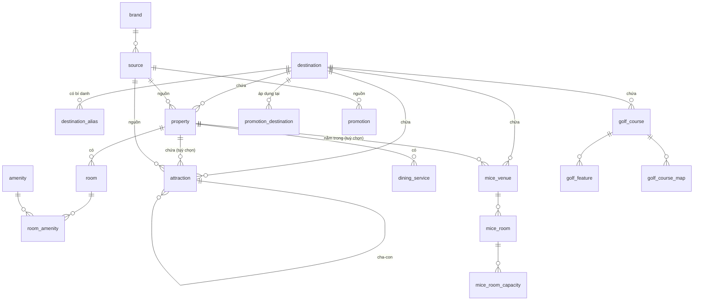
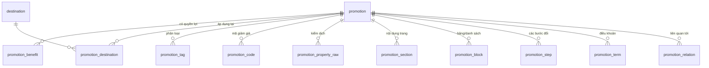
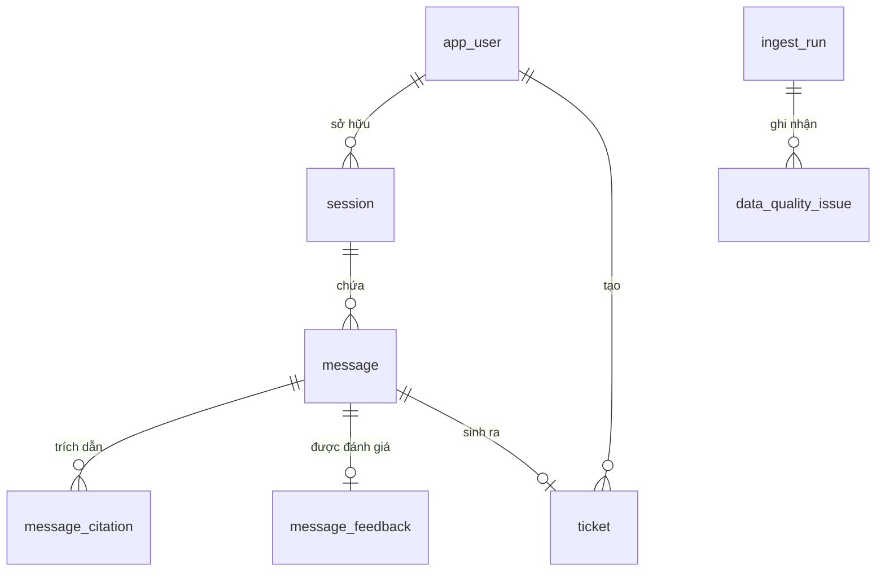

# Database Schema — Lớp CORE

PostgreSQL 16 (image `pgvector/pgvector:pg16`) · SQLAlchemy 2.0 · Alembic

Tài liệu này đặc tả **lớp CORE**: dữ liệu nghiệp vụ đã làm sạch từ `data/*.json`, cộng
các bảng ứng dụng (user / hội thoại / ticket) và bảng vận hành. Lớp RAG
(`chunk` + embedding) được **đặt chỗ nhưng chưa tạo** — xem §9.

---

## 1. Quy ước chung

| Quy ước | Nội dung |
|---|---|
| **Khoá chính CORE** | `TEXT`, sinh **tất định** — hoặc dùng id có sẵn trong data (`hotel_id`, `room_id`, `promotion_id`), hoặc `sha1(entity_type + '|' + canonical_url + '|' + natural_key)[:16]`. Re-ingest phải ra đúng id cũ, nếu không `message_citation` và `chunk` sẽ mồ côi. |
| **Khoá chính APP** | `UUID DEFAULT gen_random_uuid()`, trừ `session.id` (client sinh) và `ticket.id` (format `VP-XXXXXXXXXX` đã dùng ở `TicketService`). |
| **Thời gian** | `TIMESTAMPTZ`, luôn UTC. Ngày thuần dùng `DATE`. |
| **Tiền** | `NUMERIC(12,2)` + cột `*_currency CHAR(3)` riêng. **Không dùng float.** |
| **Enum** | `TEXT` + `CHECK`, **không** dùng `CREATE TYPE ... AS ENUM` (không xoá được value, migrate rất khổ). |
| **Cột kiểm toán** | Mọi bảng CORE có: `source_id`, `ingest_run_id`, `content_hash`, `is_active`, `created_at`, `updated_at`. |
| **Xoá** | Không `DELETE`. Entity biến mất sau re-crawl → `is_active = false`. |
| **Upsert** | `INSERT ... ON CONFLICT (id) DO UPDATE`. Toàn bộ pipeline idempotent. |
| **Text** | Đã chuẩn hoá NFC + gộp khoảng trắng trước khi ghi (xem luật làm sạch). |

---

## 1.1 Vì sao ánh xạ được từ JSON sang bảng quan hệ

### Ý tưởng nền

JSON là **cây**, cơ sở dữ liệu quan hệ là **đồ thị**. Chuyển được vì bản thân cái cây
đã mã hoá sẵn quan hệ, chỉ là viết bằng dấu ngoặc thay vì khoá ngoại:

| Trong JSON | Thực chất là |
|---|---|
| Mảng object lồng trong object | Quan hệ **1–N** (cha → con) |
| Cùng một giá trị lặp ở nhiều nơi | Quan hệ **N–N** (cần bảng tra cứu) |
| Object lồng chỉ có thuộc tính | **Composition** — thuộc tính của cha, không phải thực thể |
| Thứ tự phần tử trong mảng | Thông tin **sẽ mất** nếu không thêm cột `ord` |

Chuyển đổi **mất** đúng một thứ (thứ tự — bù bằng cột `ord`) và **được** đúng một thứ
(danh tính xuyên file — 124 dòng promotion ở 9 file hợp lại thành 38 thực thể).

Dưới đây là 10 luật, mỗi luật kèm ví dụ có thật trong `data/`.

---

### Luật 1 — Mảng object lồng nhau → bảng con + khoá ngoại

```jsonc
{ "hotels": [ { "hotel_id": "vinpearl-hotel-bac-ninh",
                "rooms": [ { "room_id": "...--room-1", "room_name": "Double Double Room" } ] } ] }
```
→ `property(id)` ←── `room(property_id)`

**Vì sao:** mảng lồng *chính là* quan hệ 1–N, chỉ viết bằng cú pháp khác.
Ở đây còn có bằng chứng thứ hai: **116/116** `room_id` bắt đầu bằng `hotel_id + '--room-'`.

Áp dụng cho: `rooms[]`, `dining_services[]`, `benefits[]`, `sections[]`, `venues[].detail.rooms[]`,
`golf_courses[].amenities[]`.

---

### Luật 2 — Object lồng không có danh tính riêng → làm phẳng thành cột

```jsonc
"room_area": { "raw": "37 m²", "square_meters": 37 }
```
→ hai cột `room.area_raw`, `room.area_sqm` — **không** tạo bảng `room_area`.

**Tiêu chí phân biệt với Luật 1:**

| | Thành bảng | Thành cột |
|---|---|---|
| Số lượng | Có thể nhiều (0..N) | Luôn 0..1 |
| Danh tính | Tồn tại độc lập, có id | Chỉ là thuộc tính của cha |
| Truy vấn | Có ai hỏi "tất cả X" không? | Không ai hỏi "tất cả room_area" |

---

### Luật 3 — Cặp `{raw, parsed}` → giữ **cả hai** cột

```jsonc
"standard_rate": { "raw": "~ 131USD", "amount": 131, "currency": null, "is_approximate": true }
```
→ `rate_raw`, `rate_amount`, `rate_currency`, `price_is_approximate`

**Vì sao giữ `raw`:** giá trị đã parse dùng để truy vấn, `raw` dùng để **kiểm chứng khi nghi ngờ**.
Chính nhờ giữ `raw` mà phát hiện được 69/116 phòng có `raw = "tel:1900232389"` —
crawler bắt nhầm link hotline thành giá. Bỏ `raw` là mất khả năng audit vĩnh viễn.

---

### Luật 4 — Mảng chuỗi lặp nhiều, từ vựng hữu hạn → bảng tra cứu + bảng nối

```jsonc
"amenities": ["Telephone", "WIFI", "Air-conditioner", "TV", "Shower", ...]
```
**1.796 giá trị nhưng chỉ ~50 giá trị khác nhau** (`Telephone` 109 lần, `WIFI` 102 lần)
→ `amenity` (50 dòng) + `room_amenity` (1.796 dòng).

**Tiêu chí:** tỉ lệ lặp cao (1796 ÷ 50 ≈ 36 lần mỗi giá trị). Lặp cao nghĩa là đây là
**từ vựng chung**, không phải văn bản tự do. Chuẩn hoá cho phép sửa một chỗ
(`WIFI` → `Wi-Fi`) áp dụng cho cả 102 dòng, và lọc `WHERE amenity_id = 'bathtub'` bằng index.

---

### Luật 5 — Mảng chuỗi tự do **có thứ tự** → bảng con + cột `ord`

```jsonc
"redemption_steps": ["Bước 1: ...", "Bước 2: ...", "Bước 3: ..."]
```
→ `promotion_step(promotion_id, ord, text)`

**Vì sao không nhét JSONB:** cần trả lời *"bước 3 của ưu đãi X là gì"*, và lớp RAG
cần chunk riêng từng đoạn để trích dẫn chính xác.
**Vì sao bắt buộc có `ord`:** JSON giữ thứ tự, bảng SQL thì **không** —
`SELECT` không kèm `ORDER BY` trả về thứ tự tuỳ ý. Quên `ord` là mất dữ liệu thật.

**Ngoại lệ:** văn bản tường thuật không bao giờ truy vấn riêng lẻ thì để JSONB —
ví dụ `itinerary[].activities[]` (41 dòng kể chuyện theo giờ, có cả dòng lặp trong nguồn).

---

### Luật 6 — Dict có **key động** → bảng EAV có kiểm soát

```jsonc
"capacities": { "Theater": "1065", "Classroom": "600", "Banquet": "600", "Cocktail": "930" }
```
→ `mice_room_capacity(room_id, layout, pax)` — **không** tạo 6 cột `capacity_theater`, …

**Vì sao:** ở đây key là **dữ liệu**, không phải schema. Biến key thành cột thì thêm một
kiểu bố trí mới = phải chạy migration. Ngoài ra câu hỏi thật là
*"phòng nào chứa 500 khách kiểu banquet"* → `WHERE layout='banquet' AND pax>=500` + index.

**"Có kiểm soát"** nghĩa là vẫn `CHECK layout IN (...)` vì từ vựng hữu hạn và đã biết hết —
EAV không kiểm soát mới là thứ nên tránh.

---

### Luật 7 — Cùng bản ghi ở nhiều file → khử trùng theo natural key, **hợp** phần khác biệt

124 dòng promotion trong 9 file → **38 thực thể**. Đã so từng cặp bản sao:
49 cặp lệch nhau và **lệch duy nhất ở `destinations`**.

→ `promotion` giữ 38 dòng (lấy bản đầu tiên) + `promotion_destination` lấy **hợp** của mọi bản sao.

**Vì sao đây là thứ JSON không làm được:** danh tính xuyên file chỉ tồn tại khi có khoá chính.
Đây chính là giá trị lớn nhất mà DB mang lại so với để nguyên file.

---

### Luật 8 — Trường suy ra được → **không lưu**

`statistics.room_count`, `item_count`, `total_promotions`, `summary.*_count`, `rag.chunk_count`

**Vì sao:** lưu số đếm là tự tạo ra một sự thật thứ hai sẽ lệch với `COUNT(*)` ngay lần sửa đầu tiên.

**Ngoại lệ có chủ ý:** `policy_document.word_count` và `content_hash` được giữ, vì chúng là
**ảnh chụp tại thời điểm crawl** — dùng để phát hiện trang nguồn đã đổi, không phải để đếm.

---

### Luật 9 — Trường lỗi của crawler → `data_quality_issue`, không phải cột nghiệp vụ

`parse_errors[]`, `errors[]`, `review_notes[]`, `summary.missing_*`

**Ngoại lệ:** giữ làm cột khi **tool truy vấn cần lọc theo nó** — `detail_status`, `is_404`,
`needs_review`, `quality_score`, `is_rate_suspect`. Ranh giới: *"có câu SQL nào `WHERE` theo nó không?"*

---

### Luật 10 — URL → tách thành thực thể `source`

**Vì sao không để URL làm cột chuỗi ở mỗi bảng:**
1. Cùng một URL xuất hiện ở nhiều bản ghi → lặp dữ liệu.
2. URL **có thuộc tính riêng**: `crawled_at`, `http_status`, `content_hash`, và ngôn ngữ
   (suy từ path `/vi/` hay `/en/` — 945 vs 127 chỉ riêng nha-trang.json).
3. Một thực thể có thể có **nhiều** nguồn — `golf_courses[].source_urls[]` có 2 URL mỗi sân,
   và mỗi `amenity`/`experience`/`map` con lại có `source_url` riêng.

Vì (3), quan hệ thực thể–nguồn là **N–N** → bảng `entity_source`. Cột `source_id` trên
mỗi bảng chỉ là **nguồn chính**, tiện cho truy vấn thường gặp.

---

## 2. Sơ đồ quan hệ

### 2.1 Nội dung chính



### 2.2 Ưu đãi



### 2.3 Ứng dụng & vận hành



---

## 2.4 Nguồn dữ liệu của từng bảng

| Bảng | File nguồn | Đường dẫn JSON |
|---|---|---|
| `brand` | `promotion/*.json` | `promotions[].source_brand`, `.related_brands[]` |
| `source` | tất cả | `source_url` / `canonical_url` / `page_information.source_url` / `documents[].source_url` |
| `destination` | **không có file** | Master data viết tay |
| `destination_alias` | promotion + entertainment + hotel + golf + event | `destinations[]`, `destination.city\|province`, `location_name`, `location.destination` |
| `media` | nhiều file | `image_url`, `image_urls[]`, `og_image`, `overview_image_urls[]`, `map_url` |
| `entity_source` | golf + promotion | `golf_courses[].source_urls[]`, `promotions[].source_urls[]`, `source_domains[]` |
| `page_link` | entertainment + promotion | `page_data.links[]`, `content_blocks[].links[]`, `card_data.topic_url`, `detail_url`, `option_url`, `related_promotions[]` |
| `property` | `hotel/vinpearl_hotel_room_dining_rag.json` | `hotels[]` |
| `room` | ↑ | `hotels[].rooms[]` |
| `amenity`, `room_amenity` | ↑ | `hotels[].rooms[].amenities[]` |
| `dining_service` | ↑ | `hotels[].dining_services[]` |
| `attraction` | `entertainment/*.json` (8 file) | Dạng A `sections{}.*.items[]` · Dạng B `+ items[].detail` · Dạng C `unique_experiences[]`, `experience_journeys[]`, `all_topics[]` |
| `attraction_itinerary_day` | `entertainment/nha-trang.json` | `all_topics[].journey_data.itinerary[]` |
| `golf_course` | `golf/golf.json` | `golf_courses[]` |
| `golf_feature` | ↑ | `.amenities[]`, `.experiences[]`, `.general_information.distinctive_features[]`, `.awards_and_recognitions[]` |
| `golf_course_map` | ↑ | `.golf_course_maps[]` |
| `mice_venue` | `event/vinpearl_mice_rag_en.json` | `venues[]` |
| `mice_room` | ↑ | `venues[].detail.rooms[]` |
| `mice_room_capacity` | ↑ | `venues[].detail.rooms[].capacities{}` |
| `promotion` | `promotion/*.json` (9 file) | `promotions[]` |
| `promotion_benefit` | ↑ | `.benefits[]` |
| `promotion_destination` | ↑ | `.destinations[]` |
| `promotion_tag` | ↑ | `.promotion_type[]`, `.applicable_services[]`, `.channels[]`, `.customer_groups[]`, `.member_tiers[]` |
| `promotion_code` | ↑ | `.promo_codes[]` (kèm `.conditions[]`, `.validity`, `.source_text`) |
| `promotion_property_raw` | ↑ | `.applicable_properties[]` |
| `promotion_section` | ↑ | `.sections[].{heading, level, content[]}` |
| `promotion_block` | ↑ | `.tables[]`, `.bullet_lists[]`, `.headings[]` |
| `promotion_step` | ↑ | `.redemption_steps[]` |
| `promotion_term` | ↑ | `.terms_and_conditions[]`, `.combination_rules[]`, `.contact_information[]` |
| `promotion_relation` | ↑ | `.related_promotions[]`, `.related_brands[]`, `.related_articles[]` |
| `faq` | `faqs/vinpearl_faqs.json` | `items[]` |
| `policy_document` | `regulations/vinpearl_regulations.json` | `documents[]` |
| `policy_section` | ↑ | `documents[].sections[]` |
| `policy_block` | ↑ | `documents[].tables[]`, `documents[].lists[]` |
| `org_info` | `about/vinpearl_about.json` | `company_info{}` + `headline`, `introduction` |
| `org_highlight` | ↑ | `hotels_and_resorts[]`, `signature_product_packages[]`, `mice[]`, `meeting_and_events[]` |
| `ingest_run` | — | Không có nguồn |
| `data_quality_issue` | — | Đầu vào một phần từ `parse_errors[]`, `errors[]`, `summary.missing_*`, `detail_status`, `is_404` |
| `app_user` … `event_log` | — | Không có trong data; suy từ code hiện có (`api/routes.py`, `services/ticket.py`, `agents/state.py`) |

## 2.5 Mức bằng chứng của từng quan hệ

### Mức A — bằng chứng cấu trúc (lồng nhau, không thể chối cãi)

Quan hệ cha–con là **hình dạng có sẵn của JSON**, không phải suy diễn:

| Quan hệ | Bằng chứng |
|---|---|
| `room` → `property` | `rooms[]` nằm trong `hotels[]`; **thêm nữa 116/116** `room_id` bắt đầu bằng `hotel_id + '--room-'` |
| `dining_service` → `property` | Lồng nhau; **68/68** `service_id` bắt đầu bằng `hotel_id + '--dining-'` |
| `mice_room` → `mice_venue` | `venues[].detail.rooms[]` |
| `mice_room_capacity` → `mice_room` | `rooms[].capacities{}` |
| `promotion_benefit` / `_destination` / `_tag` / `_code` → `promotion` | Đều lồng trong `promotions[]` |
| `policy_section` / `policy_block` → `policy_document` | `documents[].sections[]`, `.tables[]`, `.lists[]` |
| `golf_feature` / `golf_course_map` → `golf_course` | Lồng trong `golf_courses[]` |
| `attraction` → `attraction` (cha–con) | `items[].detail` (dạng B), `all_topics` (dạng C) |
| `room_amenity` → `room` | `rooms[].amenities[]` |

### Mức B — suy ra bằng khớp chuỗi (đã đo tỉ lệ)

| Quan hệ | Tỉ lệ khớp | Ghi chú |
|---|---|---|
| `org_highlight` → `property` | **9/9 khớp chính xác tuyệt đối** | Tên trong `about` trùng khít `hotel_name` |
| `mice_venue` → `property` | **5/10 khớp chính xác** | 5 chỗ còn lại là Convention Center / Theater / Almaz / VinPalace — công trình độc lập, đúng nghĩa NULL |
| `faq` → `destination` | **72/174 (41%)** | Suy từ `subcategory`: `VinWonders Nam Hoi An` (19), `Vinpearl Safari Phu Quoc` (19), `VinWonders Nha Trang` (14), `Grand World Phu Quoc` (10), `VinWonders Phu Quoc` (10). Còn lại (VinClub, Flights, General…) không có địa danh |
| mọi bảng → `destination` | 100% có trường nguồn, nhưng **cần bảng alias** | `promotion.destinations[]`, `hotel.location_name`, `entertainment.destination.city\|province`, `golf.location.destination`, `mice.destination` |

### Mức C — quy ước thiết kế của tôi (data không nói gì)

| Thứ | Lý do quy ước |
|---|---|
| Tách bảng `source` | Data để URL rải rác trong từng bản ghi; gom lại để trích dẫn và phân biệt `/vi/` vs `/en/` |
| Tách bảng `amenity` | Nguồn chỉ là mảng chuỗi lặp lại (`Telephone` 109 lần, `WIFI` 102 lần) — chuẩn hoá là quyết định của tôi, không phải bằng chứng |
| Tách bảng `brand` | Field `source_brand` có sẵn, nhưng nâng thành bảng là quy ước |
| Gộp `media` đa hình | Data có 5–6 tên field ảnh khác nhau; gom về một bảng là quyết định |
| Gộp `promotion_tag` | 5 mảng chuỗi cùng hình dạng |
| Gộp `golf_feature` | 4 mảng khác tên nhưng cùng shape `{title, description}` |
| Toàn bộ `app_user` … `event_log` | **Không hề có trong `data/`** — suy từ code hiện có |
| `ingest_run`, `data_quality_issue` | Không có nguồn |

### Phản bằng chứng — hai chỗ tôi đã thiết kế sai và đã sửa

| Sai | Kiểm chứng | Sửa |
|---|---|---|
| `attraction.property_id` FK → `property` | **0/68** giá trị `location` khớp tên khách sạn. Chúng là `VinWonders Nha Trang`, `Grand World Phu Quoc`, `The UnderWater World` — công viên/phân khu, không nằm trong `property` | Bỏ FK, giữ `location_text`; liên kết qua `parent_id` tới `attraction` `kind='park'` |
| `destination.country DEFAULT 'Vietnam'` | `Cape Wickham Golf Links` có `location.destination = "Tasmania, Australia"` | Thêm dòng `tasmania`, `country` không mặc định cứng, `region` cho phép NULL |

---

## 3. Bảng vận hành

### `ingest_run`
Mỗi lần chạy `scripts/load_core.py` là một dòng. Cho phép truy vết dòng nào được nạp bởi lần chạy nào.

| Cột | Kiểu | Ràng buộc | Ghi chú |
|---|---|---|---|
| `id` | BIGSERIAL | PK | |
| `started_at` | TIMESTAMPTZ | NOT NULL | |
| `finished_at` | TIMESTAMPTZ | | NULL = đang chạy hoặc crash |
| `status` | TEXT | CHECK (`running`,`success`,`failed`) | |
| `git_sha` | TEXT | | Phiên bản code normalize |
| `stats` | JSONB | | `{"property": 15, "room": 116, ...}` |
| `notes` | TEXT | | |

### `data_quality_issue`
Nơi chứa mọi thứ không parse được. **Không bao giờ `except: pass`.**

| Cột | Kiểu | Ràng buộc | Ghi chú |
|---|---|---|---|
| `id` | BIGSERIAL | PK | |
| `ingest_run_id` | BIGINT | FK → `ingest_run` | |
| `severity` | TEXT | CHECK (`error`,`warning`,`info`) | `error` = dòng bị loại |
| `rule` | TEXT | NOT NULL | `price.unparseable`, `destination.unknown_alias` |
| `entity_type` | TEXT | | NULL nếu dòng bị loại hẳn |
| `entity_id` | TEXT | | |
| `source_file` | TEXT | | `data/hotel/...json` |
| `json_path` | TEXT | | `hotels[3].rooms[7].standard_rate` |
| `field` | TEXT | | |
| `raw_value` | TEXT | | Giá trị gốc gây lỗi |
| `message` | TEXT | | |
| `created_at` | TIMESTAMPTZ | DEFAULT now() | |

**Index:** `(rule)`, `(ingest_run_id, severity)`

---

## 4. Trục dùng chung

### `brand`
Từ `source_brand` (vinwonders 26 / vinpearl 12) và `related_brands` (7 giá trị).

| Cột | Kiểu | Ràng buộc | Ghi chú |
|---|---|---|---|
| `id` | TEXT | PK | `vinpearl`, `vinwonders`, `vinpearl_safari`, `vinpearl_golf`, `grand_world`, `vinclub`, `myvinpearl` |
| `name` | TEXT | NOT NULL | |
| `website` | TEXT | | |

### `source`
Xuất xứ của **mọi** dòng CORE. Không có bảng này thì bot không trích dẫn được nguồn.

| Cột | Kiểu | Ràng buộc | Ghi chú |
|---|---|---|---|
| `id` | TEXT | PK | `sha1(canonical_url)[:16]` |
| `url` | TEXT | NOT NULL, UNIQUE | |
| `canonical_url` | TEXT | | |
| `domain` | TEXT | | `vinpearl.com`, `vinwonders.com` |
| `brand_id` | TEXT | FK → `brand` | |
| `source_language` | TEXT | CHECK (`vi`,`en`) | **Suy từ path URL** `/vi/` hoặc `/en/`, không lấy từ field `language` |
| `http_status` | INT | | Từ `status_code` (regulations) |
| `is_404` | BOOLEAN | DEFAULT false | Có sẵn ở nam_hoi_an |
| `crawled_at` | TIMESTAMPTZ | | |
| `content_hash` | TEXT | | |
| `html_filename` | TEXT | | **Chỉ tên file**, đã bỏ `D:\vinuni\...` |

> Data thực tế: nha-trang.json có 945 URL `/vi/` vs 127 `/en/` trong khi khai `language: "en"`.
> Vì vậy `source.source_language` (nguồn) và `*.content_language` (nội dung) là **hai cột khác nhau**.

### `destination`
**Master data viết tay** (`scripts/normalize/destinations.yaml`), không sinh từ crawl.

| Cột | Kiểu | Ràng buộc | Ghi chú |
|---|---|---|---|
| `id` | TEXT | PK | slug: `nha-trang`, `phu-quoc` |
| `name_en` | TEXT | NOT NULL | `Nha Trang` |
| `name_vi` | TEXT | NOT NULL | `Nha Trang` |
| `province` | TEXT | | |
| `region` | TEXT | CHECK (`north`,`central`,`south`) | |
| `country` | TEXT | DEFAULT `Vietnam` | **Không phải lúc nào cũng Vietnam** — xem ghi chú |
| `lat`, `lng` | NUMERIC(9,6) | | Điền tay, phục vụ câu hỏi "gần đây" |
| `has_content` | BOOLEAN | DEFAULT false | `false` cho Da Nang / Hue — chỉ xuất hiện trong promotion, không có hotel/attraction |
| `sort_order` | INT | | |

Danh sách khởi tạo: `ha-noi`, `hai-phong`, `ha-long`, `bac-ninh`, `nghe-an`, `ha-tinh`,
`hue`, `da-nang`, `hoi-an`, `nha-trang`, `ho-chi-minh`, `phu-quoc`,
**`tasmania`** (`country = 'Australia'`).

> ⚠️ `golf.json` có `Cape Wickham Golf Links` với `location.destination = "Tasmania, Australia"`.
> `region` phải cho phép NULL và `country` không được mặc định cứng thành Vietnam.

### `complex` — khu phức hợp (bổ sung sau khi khảo sát vinpearl.com)

Vinpearl tổ chức sản phẩm theo **khu phức hợp**, không phải theo khách sạn đơn lẻ.
Mỗi khu gom: nhiều khách sạn + công viên VinWonders + Safari + Grand World + sân golf +
trung tâm hội nghị. Website xác nhận ba "United Center" (Phu Quoc, Nha Trang, Nam Hoi An),
và data còn cho thấy thêm các khu khác.

| Cột | Kiểu | Ràng buộc | Ghi chú |
|---|---|---|---|
| `id` | TEXT | PK | slug: `phu-quoc-united-center` |
| `name` | TEXT | NOT NULL | |
| `destination_id` | TEXT | FK → `destination`, NOT NULL | Khu nằm trong địa danh |
| `kind` | TEXT | CHECK (`united_center`,`park_complex`,`island`) | |
| `summary` | TEXT | | |
| `source_id` | TEXT | FK → `source` | |

**Bằng chứng trong data** — trường `destination.name` của các file entertainment
thực chất là **tên khu phức hợp**, còn `destination.city`/`province` mới là địa danh:

| File | `destination.name` (= khu) | `city` / `province` (= địa danh) |
|---|---|---|
| `ha_noi.json` | Grand World Ocean City | Hanoi |
| `hai_phong_data.json` | Vu Yen Royal Island | Hai Phong |
| `ho_chi_minh_data.json` | VinWonders Grand Park | Ho Chi Minh City |
| `ha_tinh_data.json` | Ha Tinh Water Park | Ha Tinh |
| `nghe_an.json` | VinWonders Cua Hoi | Nghe An |
| `phu_quoc_all_data_en.json` | Phu Quoc (tiêu đề section: **"Welcome to PHU QUOC UNITED CENTER!"**) | — |

> Lược đồ trước đây **gộp hai khái niệm này làm một** và đó là lý do
> `attraction.location` không khớp `property` (0/68): điểm tham quan và khách sạn
> là **anh em cùng nằm trong một khu phức hợp**, không phải quan hệ cha–con.
> `property`, `attraction`, `golf_course`, `mice_venue` đều nhận thêm `complex_id` (nullable).

### `destination_alias`
Giải bài toán bẩn nhất của data: cùng một nơi có cả tên Việt lẫn tên Anh.

| Cột | Kiểu | Ràng buộc | Ghi chú |
|---|---|---|---|
| `destination_id` | TEXT | FK → `destination`, PK phần 1 | |
| `alias_normalized` | TEXT | PK phần 2, **UNIQUE toàn cục** | `lower(unaccent(alias))` |
| `alias` | TEXT | NOT NULL | Chuỗi gốc |
| `origin` | TEXT | | `crawl` \| `manual` |

Bí danh phải seed (đếm được trong data): `Hanoi`/`Hà Nội`, `Phu Quoc`/`Phú Quốc`,
`Nghe An`/`Nghệ An`, `Hoi An`/`Hội An`, `Hai Phong`/`Hải Phòng`, `Ha Tinh`/`Hà Tĩnh`,
`Ha Long`/`Hạ Long`, `Ho Chi Minh City`/`Thành phố Hồ Chí Minh`, `Hue`/`Huế`, `Da Nang`/`Đà Nẵng`.

> ⚠️ `Nationwide` (6 lần) và `Toàn quốc` (1 lần) **không phải địa danh** → dùng cột
> `promotion.is_nationwide`, không tạo dòng `destination` giả.
> `Nam Hoi An` là **complex**, không phải destination → `destination = hoi-an`, còn `Nam Hoi An` là `property`.

### `media`
Đa hình, **không có FK** (đánh đổi có chủ ý — xem §10).

| Cột | Kiểu | Ràng buộc | Ghi chú |
|---|---|---|---|
| `id` | TEXT | PK | |
| `entity_type` | TEXT | NOT NULL | `property`, `room`, `attraction`, `promotion`, ... |
| `entity_id` | TEXT | NOT NULL | |
| `url` | TEXT | NOT NULL | **Chỉ URL, không tải file về** |
| `role` | TEXT | CHECK (`hero`,`gallery`,`map`,`thumbnail`) | |
| `alt` | TEXT | | Từ `image_alt` |
| `sort_order` | INT | | |

**UNIQUE** `(entity_type, entity_id, url)` · **Index** `(entity_type, entity_id)`

### `entity_source` — quan hệ N–N với nguồn (Luật 10)
Cột `source_id` trên mỗi bảng chỉ là **nguồn chính**. Bảng này chứa các nguồn còn lại.

| Cột | Kiểu | Ràng buộc | Ghi chú |
|---|---|---|---|
| `entity_type` | TEXT | PK phần 1 | |
| `entity_id` | TEXT | PK phần 2 | |
| `source_id` | TEXT | FK → `source`, PK phần 3 | |
| `role` | TEXT | CHECK (`primary`,`secondary`,`detail`) | |

Cần thiết vì: `golf_courses[].source_urls[]` có **2 URL mỗi sân**, và mỗi `amenity` /
`experience` / `golf_course_map` con lại mang `source_url` riêng;
`promotions[].source_urls[]` + `source_domains[]` tương tự.

### `page_link` — đồ thị điều hướng của website
Dựng **hoàn toàn tự động** từ data, không cần khai báo tay.

| Cột | Kiểu | Ràng buộc | Nguồn |
|---|---|---|---|
| `id` | TEXT | PK | |
| `from_source_id` | TEXT | FK → `source`, NOT NULL | Trang chứa liên kết |
| `to_url` | TEXT | NOT NULL | |
| `to_source_id` | TEXT | FK → `source` NULL | Resolve khi trang đích cũng đã crawl |
| `anchor_text` | TEXT | | `links[].text` |
| `is_internal` | BOOLEAN | | `links[].is_internal` — **có sẵn trong data** |
| `context` | TEXT | CHECK (`card`,`body`,`related`,`detail`,`option`) | Nơi liên kết xuất hiện |

Nguồn: `page_data.links[]` (248) · `content_blocks[].links[]` (64) · `card_data.topic_url` ·
`detail_url` · `option_url` · `related_promotions[]` (61) — tổng **104 đường dẫn lá mang tính liên kết**.

---

## 5. Lưu trú — nguồn: `data/hotel/vinpearl_hotel_room_dining_rag.json`

### `property` — 15 dòng

| Cột | Kiểu | Ràng buộc | Ghi chú |
|---|---|---|---|
| `id` | TEXT | PK | Dùng `hotel_id` có sẵn: `vinpearl-hotel-bac-ninh` |
| `name` | TEXT | NOT NULL | |
| `kind` | TEXT | CHECK (`hotel`,`resort`) | Suy từ tên |
| `destination_id` | TEXT | FK → `destination`, NOT NULL | Qua `destination_alias` từ `location_name` |
| `complex_id` | TEXT | FK → `complex` | 3 United Center gom nhiều khách sạn |
| `address` | TEXT | | |
| `url`, `room_page_url`, `dining_page_url` | TEXT | | |
| `brand_id` | TEXT | FK → `brand` | |
| `source_id` | TEXT | FK → `source` | |
| `is_active` | BOOLEAN | DEFAULT true | |

### `room` — 116 dòng

| Cột | Kiểu | Ràng buộc | Ghi chú |
|---|---|---|---|
| `id` | TEXT | PK | `vinpearl-hotel-bac-ninh--room-1` (có sẵn) |
| `property_id` | TEXT | FK → `property` ON DELETE CASCADE | |
| `room_index` | INT | NOT NULL | |
| `name` | TEXT | NOT NULL | |
| `description` | TEXT | | |
| `guest_count` | INT | CHECK (> 0) | |
| `area_sqm` | NUMERIC(6,2) | | Từ `room_area.square_meters` |
| `area_raw` | TEXT | | `"37 m²"` |
| `price_from_amount` | NUMERIC(12,2) | | **Chỉ 47/116 dòng có giá thật** — xem cảnh báo |
| `price_from_currency` | CHAR(3) | | **Suy từ `raw`** — nguồn để `null` 100% |
| `price_is_approximate` | BOOLEAN | | Có dấu `~` |
| `rate_amount` | NUMERIC(12,2) | | |
| `rate_currency` | CHAR(3) | | |
| `rate_raw` | TEXT | | |
| `is_rate_suspect` | BOOLEAN | DEFAULT false | **69/116 dòng = `true`** (`standard_rate.raw = "tel:1900232389"`) |
| `price_observed_at` | TIMESTAMPTZ | | Sao từ `source.crawled_at` — bot phải nói kèm ngày (xem §15) |
| `bed_types` | JSONB | | Danh sách tự do |
| `has_wifi` | BOOLEAN | | |
| `image_url`, `page_url` | TEXT | | |
| `source_id` | TEXT | FK → `source` | |

**UNIQUE** `(property_id, room_index)`
**Index** `(destination_id, price_from_amount) WHERE price_from_amount IS NOT NULL` (qua join property, hoặc denormalize `destination_id` vào `room`)

> ⚠️ **`price_from.amount` của nguồn không dùng được.** Nguồn điền đủ 116/116 dòng,
> nhưng **69 dòng mang giá trị `1900232389`** — chính là số hotline. Cả `price_from.raw`
> lẫn `standard_rate.raw` của 69 dòng đó đều là `"tel:1900232389"`.
> Pipeline vì vậy parse từ `raw` chứ không tin `amount`, và **chỉ 47/116 phòng có giá thật**.

> Cạm bẫy parse: `"~ 1.944USD"` — dấu `.` là **phân tách nghìn**, không phải thập phân.
> Nhưng `"Dimensions: 22,839m x 12,938m"` thì dấu `,` lại là **dấu thập phân** (22,8 m × 12,9 m).
> Cùng khuôn mẫu, hai ngữ nghĩa trái ngược — nên `parse_money` và `parse_specifications`
> dùng hai hàm chuyển đổi khác nhau.

### `amenity` — ~50 dòng

| Cột | Kiểu | Ràng buộc | Ghi chú |
|---|---|---|---|
| `id` | TEXT | PK | slug: `wifi`, `bathtub` |
| `name_en` | TEXT | NOT NULL | `WIFI`, `Bathtub` |
| `name_vi` | TEXT | | |
| `category` | TEXT | CHECK (`bathroom`,`tech`,`comfort`,`service`,`other`) | |

### `room_amenity` — ~1.796 dòng
`room_id` FK · `amenity_id` FK · **PK** `(room_id, amenity_id)`

### `dining_service` — 68 dòng

| Cột | Kiểu | Ràng buộc | Ghi chú |
|---|---|---|---|
| `id` | TEXT | PK | `...--dining-1` (có sẵn) |
| `property_id` | TEXT | FK → `property` ON DELETE CASCADE | |
| `service_index` | INT | | |
| `name` | TEXT | NOT NULL | |
| `description` | TEXT | | |
| `opens_at`, `closes_at` | TIME | | Parse từ `opening_hours.raw` |
| `hours_raw`, `hours_display` | TEXT | | Giữ nguyên bản |
| `contact_raw`, `contact_display` | TEXT | | |
| `image_url` | TEXT | | |
| `source_id` | TEXT | FK → `source` | |

---

## 6. Trải nghiệm — nguồn: `data/entertainment/*.json` (8 file, 3 thế hệ schema)

### `attraction`
Một bảng gộp tất cả: công viên, show, trò chơi, sự kiện, hành trình, lý do nên đến.
Ba schema nguồn được ba adapter riêng quy về đây.

| Cột | Kiểu | Ràng buộc | Ghi chú |
|---|---|---|---|
| `id` | TEXT | PK | Dùng `document_id` nếu có (nha-trang), không thì sinh tất định |
| `destination_id` | TEXT | FK → `destination`, NOT NULL | |
| `complex_id` | TEXT | FK → `complex` | Khu phức hợp chứa điểm này |
| `parent_id` | TEXT | FK → `attraction` (tự tham chiếu) | Card → detail; công viên (`kind='park'`) → show/game bên trong |
| `kind` | TEXT | CHECK (`park`,`show`,`game`,`event`,`experience`,`journey`,`itinerary`) | Nội dung quảng cáo **không** ở đây — xem `destination_highlight` |
| `title` | TEXT | NOT NULL | |
| `summary` | TEXT | | Mô tả ngắn ở card |
| `description` | TEXT | | |
| `full_text` | TEXT | | `page_data.full_text` — nguyên liệu chunk sau này |
| `location_text` | TEXT | | Chuỗi gốc `"VinWonders Nha Trang"` |
| `section_title` | TEXT | | Giữ ngữ cảnh section gốc |
| `topic_group` | TEXT | | |
| `detail_url` | TEXT | | |
| `detail_status` | TEXT | CHECK (`available`,`missing_url`,`not_found`,`not_provided`) | Có sẵn ở phu_quoc / nam_hoi_an |
| `image_url` | TEXT | | |
| `content_language` | TEXT | CHECK (`vi`,`en`) | |
| `duration_days`, `duration_nights` | INT | | Chỉ có ở `kind='journey'` — từ `journey_data.duration` |
| `duration_label` | TEXT | | `"2 Days 1 Night"` |
| `sort_order` | INT | | |
| `source_id` | TEXT | FK → `source` | |
| `is_active` | BOOLEAN | DEFAULT true | |

**Index** `(destination_id, kind)`, `(parent_id)`

### `destination_highlight` — 28 dòng

Nội dung **quảng cáo**, tách hẳn khỏi `attraction` để bot tìm kiếm không bao giờ nhầm
câu tiếp thị thành hoạt động có thật.

| Cột | Kiểu | Ràng buộc | Ghi chú |
|---|---|---|---|
| `id` | TEXT | PK | |
| `destination_id` | TEXT | FK → `destination`, NOT NULL | |
| `complex_id` | TEXT | FK → `complex` | |
| `section_title` | TEXT | | Tiêu đề section gốc |
| `title` | TEXT | NOT NULL | |
| `description` | TEXT | | |
| `image_url` | TEXT | | |
| `sort_order` | INT | | |
| `source_id` | TEXT | FK → `source` | |

**Nguồn** — các section `reasons_*` và `welcome_*` trong `entertainment/*.json`, đã đếm đủ 28 mục:

| File | Section | Mục |
|---|---|---:|
| `hai_phong_data.json` | `welcome_to_vu_yen_royal_island` | 5 |
| `nam_hoi_an_all_data_en.json` | `welcome_to_the_land_of_heritage` | 5 |
| `phu_quoc_all_data_en.json` | `welcome_to_phu_quoc_united_center` | 5 |
| `nha-trang.json` | `destination_overview.welcome_experiences` | 4 |
| `ha_noi.json` | `reasons_to_visit_grand_world` | 3 |
| `ho_chi_minh_data.json` | `top_reasons_to_visit` | 3 |
| `nghe_an.json` | `reasons_you_must_visit` | 3 |

> ⚠️ **Không đưa bảng này vào lớp RAG** khi trả lời câu hỏi kiểu *"có gì chơi ở X"*.
> Nó chỉ dùng cho câu mở đầu giới thiệu điểm đến.

### `attraction_itinerary_day` — 7 dòng
Từ `journey_data.itinerary[]` (chỉ 3 topic có, trong nha-trang.json).

| Cột | Kiểu | Ràng buộc | Nguồn |
|---|---|---|---|
| `id` | TEXT | PK | |
| `attraction_id` | TEXT | FK ON DELETE CASCADE | |
| `day_number` | INT | NOT NULL | `itinerary[].day_number` |
| `heading` | TEXT | | `"Day 1: Conquer VinWonders…"` |
| `text` | TEXT | | |
| `activities` | JSONB | | `itinerary[].activities[]` (41 dòng) |

**UNIQUE** `(attraction_id, day_number)`

> `activities` để **JSONB chứ không phải bảng con** — đây là ngoại lệ của Luật 5: văn bản
> tường thuật theo giờ, không ai truy vấn riêng một hoạt động, và bản gốc còn có dòng lặp
> (`"Join Kid Zoo – 09:00"` xuất hiện hai lần).

> Adapter phải **duyệt `sections{}.values()`**, tuyệt đối không hardcode key —
> key là slug do parser tự đặt, tiếng Việt lẫn tiếng Anh
> (ví dụ `tan_huong_mot_mua_he_mat_lanh_tai_cong_vien_nuoc_ha_tinh`).

> ⚠️ **Không có `property_id` — thay bằng `complex_id`.** Đã kiểm chứng: **0/68** giá trị
> `location` khớp tên khách sạn nào (`VinWonders Nha Trang`, `Grand World Phu Quoc`,
> `The UnderWater World`). Khảo sát vinpearl.com giải thích vì sao: điểm tham quan và khách sạn
> là **anh em trong cùng một khu phức hợp**, không phải quan hệ cha–con.
> Vậy `attraction.complex_id` → `complex`, và giữ `location_text` thô cho phần chưa khớp được.

---

## 7. Golf & MICE

### `golf_course` — 6 dòng · nguồn `data/golf/golf.json`

| Cột | Kiểu | Ràng buộc | Ghi chú |
|---|---|---|---|
| `id` | TEXT | PK | slug từ tên |
| `destination_id` | TEXT | FK → `destination` | |
| `complex_id` | TEXT | FK → `complex` | Golf Phu Quoc thuộc Phu Quoc United Center |
| `name`, `page_url` | TEXT | | |
| `summary` | TEXT | | |
| `designer` | TEXT | | `IMG Worldwide` |
| `holes` | INT | | |
| `par` | INT | | |
| `course_length_raw` | TEXT | | `"Lake Course: 7,318 yards; ..."` — nhiều sân, giữ nguyên |
| `total_area` | TEXT | | |
| `terrain` | TEXT | | |
| `full_address`, `city`, `district`, `island` | TEXT | | |
| `source_id` | TEXT | FK → `source` | |

### `golf_feature` — ~47 dòng
Gộp `distinctive_features`, `awards_and_recognitions`, `amenities`, `experiences` — cùng hình dạng.

| Cột | Kiểu | Ràng buộc | Ghi chú |
|---|---|---|---|
| `id` | TEXT | PK | |
| `course_id` | TEXT | FK → `golf_course` ON DELETE CASCADE | |
| `kind` | TEXT | CHECK (`feature`,`award`,`amenity`,`experience`) | |
| `title` | TEXT | NOT NULL | |
| `description`, `image_url`, `detail_url` | TEXT | | |
| `sort_order` | INT | | |

### `golf_course_map`
`id` PK · `course_id` FK · `course_type` TEXT (`Marsh Course`) · `map_name` · `map_url`

### `mice_venue` — 10 dòng · nguồn `data/event/vinpearl_mice_rag_en.json`

| Cột | Kiểu | Ràng buộc | Ghi chú |
|---|---|---|---|
| `id` | TEXT | PK | |
| `destination_id` | TEXT | FK → `destination` | |
| `complex_id` | TEXT | FK → `complex` | Convention Center thuộc khu phức hợp, không thuộc khách sạn |
| `property_id` | TEXT | FK → `property` | **5/10 khớp chính xác tên khách sạn.** 5 dòng NULL là Convention Center / Theater / Almaz / VinPalace — công trình độc lập trong khu |
| `name`, `url`, `address` | TEXT | | |
| `phone` | TEXT | | `(+84) 297 3550 550` |
| `subtitle`, `summary`, `overview` | TEXT | | |
| `source_id` | TEXT | FK → `source` | |

### `mice_room` — 36 dòng

| Cột | Kiểu | Ràng buộc | Ghi chú |
|---|---|---|---|
| `id` | TEXT | PK | |
| `venue_id` | TEXT | FK → `mice_venue` ON DELETE CASCADE | |
| `name` | TEXT | NOT NULL | `Crystal Ballroom` |
| `description` | TEXT | | |
| `area_sqm` | NUMERIC(8,2) | | Parse từ `area` = `"1250m 2"` ← **bẩn, có khoảng trắng chèn** |
| `area_raw` | TEXT | | |
| `length_m`, `width_m` | NUMERIC(6,2) | | Parse từ `specifications[]`: `"Dimensions: 50m x 25m"` |
| `ceiling_height_m` | NUMERIC(5,2) | | Parse từ `"Ceiling height: 7m"` |
| `specifications_raw` | JSONB | | Giữ mảng gốc |
| `image_url` | TEXT | | |
| `sort_order` | INT | | |

### `mice_room_capacity` — ~216 dòng
`capacities` là dict `{"Theater": "1065", "Classroom": "600", ...}` — **bảng riêng, không phải JSONB**,
vì câu hỏi thật là *"phòng nào chứa 500 khách kiểu banquet?"* → cần `WHERE layout='banquet' AND pax>=500`.

| Cột | Kiểu | Ràng buộc | Ghi chú |
|---|---|---|---|
| `room_id` | TEXT | FK → `mice_room`, PK phần 1 | |
| `layout` | TEXT | PK phần 2, CHECK (`theater`,`classroom`,`u_shape`,`boardroom`,`banquet`,`cocktail`) | Chuẩn hoá về lowercase snake |
| `pax` | INT | CHECK (> 0) | Nguồn là **string**, phải ép kiểu |

---

## 8. Ưu đãi — nguồn: `data/promotion/*.json` (9 file → 38 bản ghi duy nhất)

### `promotion` — 38 dòng

| Cột | Kiểu | Ràng buộc | Ghi chú |
|---|---|---|---|
| `id` | TEXT | PK | `promotion_id` có sẵn (24 hex) |
| `slug` | TEXT | | |
| `title` | TEXT | NOT NULL | |
| `summary` | TEXT | | |
| `is_nationwide` | BOOLEAN | DEFAULT false | Thay cho destination giả `Nationwide`/`Toàn quốc` |
| `booking_from`, `booking_to`, `booking_raw` | DATE, DATE, TEXT | | ← `booking_period{}` · **10/38 có ngày** |
| `stay_from`, `stay_to`, `stay_raw` | DATE, DATE, TEXT | | ← `stay_period{}` · **7/38** |
| `validity_from`, `validity_to`, `validity_raw` | DATE, DATE, TEXT | | ← `general_validity{}` · **32/38** |
| `purchase_from`, `purchase_to`, `purchase_raw` | DATE, DATE, TEXT | | ← `purchase_period{}` · **2/38** |
| `redemption_from`, `redemption_to`, `redemption_raw` | DATE, DATE, TEXT | | ← `redemption_period{}` · **2/38** |
| `excluded_dates` | JSONB | | ← `excluded_dates[]` (24 giá trị) |
| `recurring_schedule` | TEXT | | ← `recurring_schedule` |
| `quality_score` | REAL | | Crawler tự chấm, 0.68–1.0 |
| `needs_review` | BOOLEAN | | Crawler tự đánh dấu |

> ✅ **KHÔNG parse `status_reason`.** Data **đã có sẵn 5 object khoảng thời gian** đã tách
> `{start_date, end_date, raw_text}`: `booking_period`, `stay_period`, `general_validity`,
> `purchase_period`, `redemption_period`. Dùng thẳng chúng.
> `status_reason` chỉ là chuỗi giải thích sinh ra *từ* các object này — parse lại là làm thừa và kém chính xác hơn.
| `status_at_crawl` | TEXT | CHECK (`active`,`upcoming`,`expired`,`unknown`) | **Chỉ tham chiếu, không dùng để lọc** |
| `status_reason_raw` | TEXT | | Chuỗi gốc |
| `status_calculated_at` | TIMESTAMPTZ | | `2026-08-01` — đã cũ |
| `brand_id` | TEXT | FK → `brand` | vinwonders 26 / vinpearl 12 |
| `booking_url`, `app_url`, `terms_url` | TEXT | | |
| `content_language` | TEXT | CHECK (`vi`,`en`) | |
| `source_id` | TEXT | FK → `source` | |
| `first_seen_at`, `last_seen_at` | TIMESTAMPTZ | | |

> **Năm loại ngày, không được gộp.** "Đặt trước 30/9 để ở đến 31/12" là hai khoảng riêng biệt;
> `purchase` (mua voucher) và `redemption` (dùng voucher) lại là hai khoảng khác nữa.

### Cột bổ sung trên `promotion`

| Cột | Kiểu | Nguồn |
|---|---|---|
| `discount_text` | TEXT | `discount_text` |
| `full_text` | TEXT | `full_text` — nguyên liệu chunk |
| `word_count` | INT | `word_count` |
| `content_hash` | TEXT | `content_hash` |
| `crawl_method` | TEXT | `crawl_method` |
| `published_at`, `source_updated_at` | TIMESTAMPTZ | `published_at`, `updated_at` |

> `review_notes[]` (35 giá trị) **không** thành cột → đổ vào `data_quality_issue` với `severity='info'`
> (Luật 9). Riêng `quality_score` và `needs_review` giữ làm cột vì tool cần `WHERE` theo chúng.

### `promotion_section` — ~132 dòng
Cấu trúc trang ưu đãi, hình dạng giống hệt `policy_section` (Luật 1 + Luật 5).

| Cột | Kiểu | Ràng buộc | Nguồn |
|---|---|---|---|
| `id` | TEXT | PK | |
| `promotion_id` | TEXT | FK ON DELETE CASCADE | |
| `ord` | INT | NOT NULL | Thứ tự trong `sections[]` |
| `heading` | TEXT | | `sections[].heading` |
| `level` | INT | | `sections[].level` |
| `content` | TEXT | | Nối `sections[].content[]` (758 dòng) |

**UNIQUE** `(promotion_id, ord)`

### `promotion_block` — ~250 dòng
Gộp `tables[]` (665 ô), `bullet_lists[]` (527 mục), `headings[]` (158) — đều là khối có cấu trúc.

| Cột | Kiểu | Ghi chú |
|---|---|---|
| `id` | TEXT PK | |
| `promotion_id` | TEXT FK | |
| `ord` | INT | |
| `block_type` | TEXT CHECK (`table`,`bullet_list`,`heading`) | |
| `caption` | TEXT | `tables[].caption` |
| `payload` | JSONB | table → `{rows}` · list → `{type, items}` · heading → `{level, text}` |

### `promotion_step` — 74 dòng
`id` PK · `promotion_id` FK · `ord` INT · `text` TEXT — từ `redemption_steps[]` (Luật 5).

### `promotion_term` — ~54 dòng
Gộp ba mảng cùng bản chất "điều khoản dạng danh sách có thứ tự":

| Cột | Kiểu | Nguồn |
|---|---|---|
| `id` | TEXT PK | |
| `promotion_id` | TEXT FK | |
| `kind` | TEXT CHECK (`term`,`combination`,`contact`) | `terms_and_conditions[]` (26) · `combination_rules[]` (11) · `contact_information[]` (17) |
| `ord` | INT | |
| `text` | TEXT | |

### `promotion_relation` — ~107 dòng

| Cột | Kiểu | Nguồn |
|---|---|---|
| `id` | TEXT PK | |
| `promotion_id` | TEXT FK | |
| `kind` | TEXT CHECK (`related_promotion`,`related_brand`,`related_article`) | |
| `target_url` | TEXT | `related_promotions[]` (61), `related_articles[]` |
| `target_promotion_id` | TEXT FK → `promotion` NULL | Resolve được khi URL trỏ tới ưu đãi đã có |
| `target_brand_id` | TEXT FK → `brand` NULL | `related_brands[]` (46) |

> `image_urls[]` (103) không cần bảng mới — nạp vào `media` với
> `entity_type='promotion'`, `role='gallery'`.

**View trạng thái thật** (không tin dữ liệu cào):
```sql
CREATE VIEW promotion_active AS
SELECT * FROM promotion
WHERE is_active
  AND (booking_to  IS NULL OR booking_to  >= CURRENT_DATE)
  AND (validity_to IS NULL OR validity_to >= CURRENT_DATE);
```

### `promotion_benefit` — 310 dòng

| Cột | Kiểu | Ràng buộc | Ghi chú |
|---|---|---|---|
| `id` | TEXT | PK | |
| `promotion_id` | TEXT | FK → `promotion` ON DELETE CASCADE | |
| `benefit_type` | TEXT | CHECK (`percentage_discount`,`voucher`,`upgrade`,`hotel_credit`,`multiplier`,`fixed_amount_discount`,`gift`,`free_ticket`) | Phân bố: 243/33/16/8/5/2/2/1 |
| `value` | NUMERIC(12,2) | | |
| `unit` | TEXT | CHECK (`percent`,`VND`,`times`) hoặc NULL | **20/310 dòng NULL** — không được mặc định thành `percent` |
| `is_maximum` | BOOLEAN | | Từ field `maximum` (`"Up to 15% off"`) |
| `description`, `source_text` | TEXT | | |
| `sort_order` | INT | | |

### `promotion_destination` — ~90 dòng
`promotion_id` FK · `destination_id` FK · **PK** cả hai.

> **Quy tắc gộp bản sao:** 33/38 promotion xuất hiện ở nhiều file. Đã đối chiếu từng cặp:
> 49 cặp lệch nhau và **lệch duy nhất ở trường `destinations`**. Vậy `promotion` lấy bản đầu tiên,
> `promotion_destination` lấy **hợp** của tất cả các bản. Không cần luật ưu tiên.

### `promotion_tag`
Gộp 4 chiều phân loại có cùng hình dạng (mảng chuỗi slug) vào một bảng.

| Cột | Kiểu | Ràng buộc | Ghi chú |
|---|---|---|---|
| `promotion_id` | TEXT | FK, PK phần 1 | |
| `tag_type` | TEXT | PK phần 2, CHECK (`promotion_type`,`service`,`channel`,`customer_group`,`member_tier`) | |
| `tag_value` | TEXT | PK phần 3 | |

Từ vựng thực tế: `promotion_type` 235 giá trị (`cross_brand_offer`, `food_offer`, `ticket_discount`…);
`service` 209 (`experience`, `theme_park_ticket`, `food_and_beverage`…);
`channel` 49 (`mobile_app`, `website`, `front_desk`, `call_center`…);
`customer_group` 53 (`app_user`, `family`, `vinclub_member`…); `member_tier` 15 (`Gold`/`Platinum`/`Diamond`).

### `promotion_code` — ~45 dòng

| Cột | Kiểu | Ràng buộc | Ghi chú |
|---|---|---|---|
| `id` | TEXT | PK | |
| `promotion_id` | TEXT | FK → `promotion` | |
| `code` | TEXT | NOT NULL | `MEMBER3`, `HAPPY10` |
| `description` | TEXT | | Nhiều dòng bẩn (`"| 2% | "`, `"/MEMBER"`) → ghi warning |
| `validity` | TEXT | | `promo_codes[].validity` |
| `source_text` | TEXT | | `promo_codes[].source_text` |
| `conditions` | JSONB | | `promo_codes[].conditions[]` (20 giá trị) |
| `is_suspect` | BOOLEAN | DEFAULT false | `code = 'NONE'` là rác |

### `promotion_property_raw` — bảng kiểm dịch
`applicable_properties` có 327 giá trị nhưng **hầu hết là chuỗi cụt** do lỗi parse:
`"Vinwonders Wave Park &"`, `"Vinwonders Phu Quoc |"`, `"Vinwonders Nha Trang –"`.

| Cột | Kiểu | Ghi chú |
|---|---|---|
| `id` | TEXT PK | |
| `promotion_id` | TEXT FK | |
| `raw_value` | TEXT | Nguyên văn |
| `matched_property_id` | TEXT FK → `property` NULL | Khớp mờ bằng `pg_trgm`, đa số sẽ NULL |
| `match_score` | REAL | |

> **Không FK trực tiếp `applicable_properties` vào `property`.** Dữ liệu chưa đủ sạch;
> ép ràng buộc sẽ làm hỏng cả lần nạp.

---

## 9. Tri thức

### `faq` — 174 dòng · nguồn `data/faqs/vinpearl_faqs.json`

| Cột | Kiểu | Ràng buộc | Ghi chú |
|---|---|---|---|
| `id` | TEXT | PK | `sha1(question)[:16]` |
| `category` | TEXT | NOT NULL | 7 giá trị: General, Hotels, Bundle, Tours & Experiences, Flights, VinClub, VinWonders & Safari |
| `subcategory` | TEXT | | `VinWonders Phu Quoc`, `Voucher`, … |
| `question`, `answer` | TEXT | NOT NULL | |
| `destination_id` | TEXT | FK → `destination` | **72/174 dòng (41%)** suy được từ `subcategory`; còn lại NULL |
| `content_language` | TEXT | CHECK (`vi`,`en`) | |
| `sort_order` | INT | | |
| `source_id` | TEXT | FK → `source` | |

**Index** `(category, subcategory)`

### `policy_document` — 7 dòng · nguồn `data/regulations/vinpearl_regulations.json`

| Cột | Kiểu | Ràng buộc | Ghi chú |
|---|---|---|---|
| `id` | TEXT | PK | id có sẵn (`ab8c79e6ba880330`) |
| `title`, `h1` | TEXT | | |
| `category` | TEXT | | `general_terms`, `privacy`, … |
| `plain_text` | TEXT | | Tới 39.061 ký tự — nguyên liệu chunk |
| `word_count` | INT | | |
| `content_hash` | TEXT | | Có sẵn |
| `effective_from` | DATE | | Nếu trích được |
| `source_id` | TEXT | FK → `source` | |

### `policy_section` — 36 dòng
`id` PK · `document_id` FK ON DELETE CASCADE · `ord` INT · `heading` TEXT · `content` TEXT
· **UNIQUE** `(document_id, ord)`

### `policy_block` — ~10 dòng
Gộp `tables[]` và `lists[]` — đều là khối có cấu trúc, hiếm khi truy vấn riêng lẻ.

| Cột | Kiểu | Ghi chú |
|---|---|---|
| `id` | TEXT PK | |
| `document_id` | TEXT FK | |
| `ord` | INT | |
| `block_type` | TEXT CHECK (`table`,`list`) | |
| `payload` | JSONB | table → `{headers, rows}`; list → `{type: "ol", items: [...]}` |

### `org_info` — 1 dòng · nguồn `data/about/vinpearl_about.json`
Ràng buộc một dòng duy nhất: `id SMALLINT PK DEFAULT 1 CHECK (id = 1)`.
Cột: `headline`, `introduction`, `address`, `hotline`, `account_holder`, `bank_account`,
`bank`, `business_registration`, `issued_by`, `source_id`.

Thêm ba cột cho khối giới thiệu trang MICE (`event/vinpearl_mice_rag_en.json` → `page_intro`):
`mice_intro_title`, `mice_intro_description`, `mice_intro_cta` (`"Send an Inquiry"`).

### `org_highlight` — ~14 dòng
`id` PK · `kind` CHECK (`hotel_resort`,`package`,`mice`,`meeting_event`) · `name` · `description`
· `destination_id` FK NULL · `property_id` FK NULL · `sort_order` · `source_id`

> `property_id`: **9/9** mục `hotels_and_resorts[]` khớp chính xác tuyệt đối `hotel_name`.
> Đây là quan hệ khớp chuỗi đáng tin nhất trong toàn bộ data.

---

## 10. Ứng dụng

### `app_user`
Anonymous-first: người dùng chưa đăng nhập **vẫn có một dòng**. Khi nào cần tài khoản
thật thì điền `email` + `password_hash` vào đúng dòng đó — lịch sử chat không mất.

| Cột | Kiểu | Ràng buộc | Ghi chú |
|---|---|---|---|
| `id` | UUID | PK DEFAULT `gen_random_uuid()` | |
| `anon_id` | TEXT | UNIQUE | Client sinh, lưu localStorage |
| `email` | CITEXT | UNIQUE, NULL | NULL = chưa từng đăng nhập |
| `password_hash` | TEXT | NULL | argon2/bcrypt |
| `display_name` | TEXT | | |
| `locale` | TEXT | DEFAULT `vi` | |
| `is_staff` | BOOLEAN | DEFAULT false | Cho trang quản trị ticket |
| `created_at`, `last_seen_at` | TIMESTAMPTZ | | |

### `session`

| Cột | Kiểu | Ràng buộc | Ghi chú |
|---|---|---|---|
| `id` | TEXT | PK | Client sinh — khớp `ChatRequest.session_id` |
| `user_id` | UUID | FK → `app_user` ON DELETE SET NULL | Nullable, khớp `user_id: str \| None` hiện tại |
| `channel` | TEXT | CHECK (`web`,`api`) | |
| `language` | TEXT | | |
| `started_at`, `last_activity_at` | TIMESTAMPTZ | | |
| `client_meta` | JSONB | | UA + platform. **Đừng lưu đủ để fingerprint thiết bị.** |

### `message`

| Cột | Kiểu | Ràng buộc | Ghi chú |
|---|---|---|---|
| `id` | UUID | PK | |
| `session_id` | TEXT | FK → `session` ON DELETE CASCADE | |
| `user_id` | UUID | FK → `app_user` ON DELETE SET NULL | |
| `seq` | INT | NOT NULL | **UNIQUE** `(session_id, seq)` |
| `role` | TEXT | CHECK (`user`,`assistant`,`system`,`tool`) | |
| `content` | TEXT | NOT NULL | **Nơi duy nhất lưu nội dung thô** (chứa PII) |
| `language` | TEXT | | Từ `AgentState.original_language` |
| `route` | TEXT | CHECK (`greeting`,`out_of_scope`,`rag`) | Khớp `RouteName` ở `src/agents/state.py` |
| `model` | TEXT | | |
| `prompt_tokens`, `completion_tokens` | INT | | |
| `cost_usd` | NUMERIC(10,6) | | |
| `latency_ms` | INT | | |
| `finish_reason`, `error` | TEXT | | |
| `created_at` | TIMESTAMPTZ | DEFAULT now() | |

### `message_citation`
Hiện `routes.py` dựng `SourceItem` rồi **vứt đi**. Bảng này giữ lại — nền tảng cho `eval/`.

| Cột | Kiểu | Ràng buộc | Ghi chú |
|---|---|---|---|
| `message_id` | UUID | FK ON DELETE CASCADE, PK phần 1 | |
| `rank` | INT | PK phần 2 | |
| `entity_type` | TEXT | | Trỏ thẳng CORE — **dùng được ngay khi chưa có bảng `chunk`** |
| `entity_id` | TEXT | | |
| `chunk_id` | TEXT | NULL | Điền sau khi có lớp RAG |
| `score` | REAL | | |

### `message_feedback`
`id` PK · `message_id` FK **UNIQUE** · `user_id` FK · `rating` SMALLINT CHECK (`-1`,`1`) ·
`comment` TEXT · `created_at`

### `ticket`
Thay `storage/tickets.jsonl`.

| Cột | Kiểu | Ràng buộc | Ghi chú |
|---|---|---|---|
| `id` | TEXT | PK | Giữ format `VP-XXXXXXXXXX` đang dùng |
| `user_id` | UUID | FK → `app_user` | |
| `session_id` | TEXT | FK → `session` | |
| `message_id` | UUID | FK → `message` | Tin nhắn châm ngòi |
| `status` | TEXT | CHECK (`open`,`in_progress`,`resolved`,`closed`) | |
| `reason` | TEXT | | Từ `AgentState.ticket_id` flow |
| `priority` | TEXT | CHECK (`low`,`normal`,`high`) | |
| `message`, `language` | TEXT | | |
| `assignee` | TEXT | | |
| `created_at`, `updated_at`, `resolved_at` | TIMESTAMPTZ | | |

### `event_log`
`id` BIGSERIAL · `ts` · `user_id` · `session_id` · `event_type` · `payload` JSONB

> **Không lưu `content` thô ở đây** — chỉ độ dài + hash. Nội dung chỉ tồn tại ở `message`,
> một chỗ duy nhất, để chính sách xoá/lưu trữ chỉ phải áp một nơi.

---

## 11. Đặt chỗ cho lớp RAG (chưa tạo)

```sql
chunk(
  id TEXT PK, entity_type TEXT, entity_id TEXT,
  destination_id TEXT FK, language TEXT,
  title TEXT, text TEXT, token_count INT, content_hash TEXT,
  metadata JSONB,
  embedding vector(384),                      -- multilingual-e5-small
  tsv tsvector GENERATED ALWAYS AS (...) STORED
)
```
Điều kiện tiên quyết đã thoả ở CORE: **id tất định** + `content_hash` để chỉ re-embed phần đổi.

---

## 12. Index cần có ngay

```sql
CREATE EXTENSION IF NOT EXISTS unaccent;
CREATE EXTENSION IF NOT EXISTS pg_trgm;

CREATE UNIQUE INDEX ON destination_alias (alias_normalized);
CREATE INDEX ON room (property_id);
CREATE INDEX ON room (price_from_amount) WHERE price_from_amount IS NOT NULL;
CREATE INDEX ON attraction (destination_id, kind);
CREATE INDEX ON attraction (parent_id);
CREATE INDEX ON promotion (validity_to) WHERE is_active;
CREATE INDEX ON promotion_tag (tag_type, tag_value);
CREATE INDEX ON mice_room_capacity (layout, pax);
CREATE INDEX ON faq (category, subcategory);
CREATE INDEX ON media (entity_type, entity_id);
CREATE INDEX ON message (session_id, seq);
CREATE INDEX ON data_quality_issue (rule);
CREATE INDEX ON property USING gin (name gin_trgm_ops);
```

---

## 13. Những quyết định gây tranh cãi

| Quyết định | Lý do | Đánh đổi |
|---|---|---|
| `media` đa hình **không FK** | 6 loại entity đều có ảnh; 6 bảng ảnh riêng là ồn ào vô ích | Không có toàn vẹn tham chiếu — phải dọn mồ côi bằng job định kỳ |
| `attraction` một bảng cho 8 `kind` | Ba schema nguồn thực chất cùng hình dạng *card + detail* | Vài cột luôn NULL với `kind` nhất định |
| `promotion_tag` gộp 4 chiều | Cùng hình dạng mảng chuỗi, cùng cách truy vấn | Không có FK tới từ vựng chuẩn; sai chính tả lọt được |
| `mice_room_capacity` là **bảng**, không JSONB | Câu hỏi thật cần `WHERE layout=? AND pax>=?` | Thêm một bảng cho 216 dòng |
| Bỏ `promotion_status` đã cào | Tính lúc `2026-08-01`, sai ngay khi nạp | Phải tự parse ngày, 4/38 sẽ `unknown` |
| `promotion_property_raw` tách riêng | 327 giá trị hầu hết là chuỗi cụt do lỗi parse | Cần bước khớp mờ sau, không dùng ngay được |
| `TEXT` + `CHECK` thay `ENUM` | Enum Postgres không xoá được value, migrate rất khổ | Mất một chút an toàn kiểu ở tầng DB |
| Không có bảng `raw_document` | File JSON đã nằm trong git — đó chính là lớp bronze | Khi crawler chạy tự động và không commit nữa thì phải bổ sung |

---

## 14. Tổng kết số lượng

| Nhóm | Số bảng | Số dòng ước tính |
|---|---:|---:|
| Vận hành | 2 | thay đổi |
| Trục dùng chung | 8 | ~95 + ~400 liên kết |
| Lưu trú | 5 | ~2.045 |
| Trải nghiệm | 3 | ~240–440 |
| Golf & MICE | 6 | ~310 |
| Ưu đãi | 11 | ~1.140 |
| Tri thức | 6 | ~240 |
| Ứng dụng | 7 | tăng dần |
| **Tổng** | **48** | **≈ 4.430 + log** |

### Cấu trúc URL của vinpearl.com (khảo sát 2026-08-06)

Xác nhận phân tầng của lược đồ. `vinpearl.com` và `vinwonders.com` chặn truy cập tự động (403),
nên phần này lấy từ kết quả tìm kiếm cộng với 3.100 URL có sẵn trong data.

| Khuôn mẫu URL | Ứng với bảng |
|---|---|
| `/en/hotels` | index |
| `/en/hotels-{destination}` | lọc theo `destination` |
| `/en/hotels/{slug}` (113 lần trong data) | `property` |
| `/en/hotels/{slug}/rooms` (144) | `room` |
| `/en/hotels/{slug}/foods` (102) | `dining_service` |
| `/en/{destination}` · `/en/{destination}/{category}/{item}` | `complex` + `attraction` |
| `/vi/uu-dai/{slug}` (464 trên vinwonders) | `promotion` |
| `/en/wonderpedia/{category}/{slug}` (~500) | **chưa có bảng** — bài viết biên tập, hiện chỉ tồn tại như đích của `page_link` |

### Độ phủ so với dữ liệu nguồn

| | Số lượng |
|---|---:|
| Đường dẫn lá khác nhau trong `data/` | 639 |
| Cố ý bỏ (`statistics.*`, `items_by_category` trùng `items[]`, `extraction.*`) | ~60 |
| Hoãn sang lớp RAG (`rag.chunks[]`, `page_data.content_blocks[]`, `sections[].blocks[]`) | ~180 |
| **Còn lại — schema phải phủ** | **~400** |

---

## 15. Quyết định đã chốt

Sáu câu hỏi thiết kế cần người quyết, đã có câu trả lời (2026-08-06). Ghi lại ở đây
để không phải bàn lại, và để người vào sau biết vì sao lược đồ có hình dạng này.

### 15.1 `Hoi An` là địa danh, `Nam Hoi An` là khu phức hợp nằm trong nó

**Đã thực hiện** trong [`src/normalize/destinations.yaml`](../src/normalize/destinations.yaml).
`hoi-an` là địa danh; `nam-hoi-an` là một dòng `complex` trỏ về nó. Áp dụng cùng cách cho
`Grand World Ocean City` (trong `ha-noi`), `Vu Yen Royal Island` (trong `hai-phong`),
`VinWonders Grand Park` (trong `ho-chi-minh`), `Phu Quoc United Center` (trong `phu-quoc`).

Hệ quả: câu hỏi *"Hội An có gì chơi"* gom được cả dữ liệu ghi `Hoi An` lẫn `Nam Hoi An`.
Bí danh `Nam Hoi An → hoi-an` là **bắt buộc**: chuỗi `Hoi An` chỉ xuất hiện trong promotion,
còn hotel/golf/mice đều ghi `Nam Hoi An`. Thiếu nó là mất hẳn ba nhóm dữ liệu.

### 15.2 Nội dung quảng cáo tách thành bảng riêng

Bảng `destination_highlight` (28 dòng). Bỏ `highlight` khỏi `attraction.kind`.
Adapter phải phân loại được section nào là quảng cáo — dùng đúng 7 section đã liệt kê
trong §6, không đoán bằng từ khoá.

### 15.3 Giá mâu thuẫn: không chọn nguồn thắng, trả cả hai kèm nguồn và ngày

Không thêm bảng nào. Lược đồ đã đủ để thực hiện:

- `room.price_from_*` và `room.rate_*` là **hai quan sát độc lập**, giữ song song, không hợp nhất.
- `room.price_observed_at` (sao từ `source.crawled_at`) cho phép câu trả lời kèm ngày.
- `promotion` có nguồn và khoảng ngày riêng, nên mức giảm không bao giờ bị trộn vào giá gốc.
- `message_citation` ghi lại từng nguồn đã dùng để sinh câu trả lời.

Quy tắc cho tầng agent: **giá tiền** → nêu mọi con số kèm nguồn và ngày quan sát.
**Thông tin không phải giá** (địa chỉ, giờ mở cửa, số điện thoại) → lấy nguồn chính thức
của khách sạn, không cần liệt kê nhiều nguồn.

> Lý do: chatbot khách sạn nói sai giá là rủi ro nghiệp vụ thật, không phải rủi ro kỹ thuật.

### 15.4 Wonderpedia: không cào, chỉ lưu đường dẫn

~500 liên kết tới `vinwonders.com/wonderpedia/{category}/{slug}` nằm trong `page_link`
với `to_source_id IS NULL`. Bot được phép dẫn link, không được tóm tắt nội dung.
Cào Wonderpedia là việc của vòng sau, sau khi lớp CORE chạy ổn.

### 15.5 Rà trang crawler không lấy được: hoãn

Chưa xử lý ở giai đoạn này. Lỗi `empty_content` của `vinclub/terms-of-use` vẫn nằm trong
`data_quality_issue` như mọi lỗi khác, nên khi cần quay lại thì đã có sẵn dấu vết.

### 15.6 `page_intro` của MICE vào `org_info`

Ba cột: `mice_intro_title`, `mice_intro_description`, `mice_intro_cta`.

---

## 15.7 Master data địa danh — đã nạp

[`src/normalize/destinations.yaml`](../src/normalize/destinations.yaml) +
[`scripts/seed_destinations.py`](../scripts/seed_destinations.py).

```bash
python -m scripts.seed_destinations --check   # đối chiếu với data/, không ghi
python -m scripts.seed_destinations           # nạp (upsert, chạy lại vô hại)
```

Kết quả đã kiểm chứng: **13 địa danh · 32 bí danh · 8 khu phức hợp**.
Chạy hai lần ra đúng cùng số liệu.

| | Số lượng |
|---|---:|
| Chuỗi địa danh khác nhau trong `data/` | 26 |
| Tra ra được địa danh | 24 |
| Cố ý không phải địa danh (`Nationwide`, `Toàn quốc`) | 2 |
| Không tra được | **0** |

Bí danh khai trong YAML là 63 nhưng chỉ sinh 32 dòng: `normalize_alias` bỏ dấu, thường hoá
và bỏ dấu câu nên `Hà Nội` / `Ha Noi` / `ha_noi` / `ha-noi` ra cùng một khoá. YAML vẫn liệt kê
đủ biến thể để người review thấy rõ cái gì đã được phủ; seeder tự khử trùng.

> Nếu không khử trùng, Postgres từ chối cả câu lệnh với lỗi
> *"ON CONFLICT DO UPDATE command cannot affect row a second time"* — đúng ra là vậy,
> vì hai dòng cùng khoá trong một câu INSERT là mâu thuẫn thật.

Lưới an toàn: [`tests/test_destinations_yaml.py`](../tests/test_destinations_yaml.py) đỏ ngay
khi crawler mang về một chuỗi địa danh chưa có bí danh — thiếu bí danh thì cả nhánh dữ liệu đó
âm thầm thành NULL chứ không báo lỗi.

---

## 16. Chạy database

Mã nguồn tầng database nằm ở **`src/db/`** — `base.py` (Base, mixin), `core.py` (41 bảng CORE),
`app.py` (7 bảng ứng dụng), `errors.py` (đọc SQLSTATE độc lập driver).
`src/models/` chỉ chứa Pydantic schema của API, cố ý **không** import gì từ `src/db/`
để tầng API không phải nạp SQLAlchemy.

```bash
make db-up          # Postgres 16 + pgvector, chờ tới khi healthy
make migrate-up     # alembic upgrade head -> 48 bảng
make db-check       # báo lỗi nếu model và DB lệch nhau
make db-tables      # liệt kê bảng
make db-reset       # XOÁ SẠCH dữ liệu rồi dựng lại
```

Trạng thái đã kiểm chứng (2026-08-06): **49 bảng** (48 của lược đồ + `alembic_version`),
**1 view** (`promotion_active`), **92 khoá ngoại**, extension `unaccent` + `pg_trgm`.
Vòng đời `downgrade base` → `upgrade head` chạy sạch, `alembic check` không phát hiện lệch.

### 16.1 Ba cạm bẫy của môi trường này

**Driver là `pg8000`, không phải `psycopg`.** `psycopg[binary]` và `psycopg2-binary` đều bị
chặn không nạp được DLL. Nguyên nhân đã xác định: **Smart App Control đang ở chế độ Enforce**
(`HKLM\SYSTEM\CurrentControlSet\Control\CI\Policy` → `VerifiedAndReputablePolicyState = 1`).
`pg8000` thuần Python nên không dính. Ở quy mô ~4.400 dòng chênh lệch tốc độ không đáng kể.
URL dùng scheme `postgresql+pg8000://`.

> ⚠️ **Đừng tắt Smart App Control để dùng psycopg.** Nó là công tắc một chiều: tắt rồi thì
> không bật lại được nếu không cài lại Windows. Nếu thật sự cần psycopg, chạy alembic
> *bên trong container* (Linux, không dính policy) thay vì đổi cấu hình bảo mật của máy.

**`pg8000` ném sai lớp ngoại lệ.** Đã đo bằng thực nghiệm:

| Vi phạm | SQLSTATE | Lớp ngoại lệ |
|---|---|---|
| UNIQUE / khoá chính trùng | `23505` | `IntegrityError` |
| CHECK | `23514` | **`ProgrammingError`** |
| FOREIGN KEY | `23503` | **`ProgrammingError`** |

→ Chỉ bắt `IntegrityError` sẽ **để lọt** mọi vi phạm CHECK và khoá ngoại — đúng hai thứ mà
lược đồ này dựa vào để chặn dữ liệu bẩn.

Đã có sẵn helper đọc mã lỗi độc lập driver ở [`src/db/errors.py`](../src/db/errors.py)
(hoạt động với cả pg8000, psycopg3 và psycopg2, nên đổi driver không phải sửa script nạp):

```python
from sqlalchemy.exc import DBAPIError
from src.db.errors import CHECK_VIOLATION, describe, is_integrity_violation, sqlstate

try:
    session.commit()
except DBAPIError as exc:            # KHÔNG phải IntegrityError
    if is_integrity_violation(exc):
        issues.append(IssueIn(rule=f"db.{sqlstate(exc)}", message=describe(exc)))
```

Kiểm chứng bằng [`tests/test_db_errors.py`](../tests/test_db_errors.py) — chạy trên database
thật, tự bỏ qua nếu Postgres chưa lên.

**Model không khai báo `relationship()`** — cố ý, vì đường ghi chính là bulk upsert chứ không
phải unit-of-work. Hệ quả: `Session.flush()` **không tự sắp thứ tự INSERT theo khoá ngoại**.
Script nạp phải chèn theo thứ tự bảng tường minh (§ "Thứ tự bắt buộc"). Lược đồ **không có
vòng phụ thuộc** — `Base.metadata.sorted_tables` chạy sạch, nên có thể lấy thứ tự từ đó.

### 16.2 Test dùng chung database dev — không được `TRUNCATE`

`tests/test_db_errors.py` chạy trên chính database dev, nơi đã có master data thật.
Bản đầu của fixture dùng `TRUNCATE ... CASCADE` và **xoá sạch 13 địa danh + 32 bí danh +
8 khu phức hợp** ngay lần chạy `pytest` đầu tiên.

Quy tắc: mọi test chạm database phải tạo dòng có **tiền tố `t-`** và chỉ xoá đúng những
dòng đó, theo thứ tự ngược khoá ngoại. Không `TRUNCATE`, không `DELETE` không điều kiện.

Khi nào dữ liệu nhiều lên thì nên tách hẳn database riêng cho test (`vinpearl_test`).

### 16.3 `alembic.ini` phải thuần ASCII

Alembic đọc file này bằng encoding locale của hệ điều hành (cp1252 trên máy này), nên chú thích
tiếng Việt có dấu sẽ làm `UnicodeDecodeError`. Chú thích trong `alembic.ini` viết bằng tiếng Anh;
`alembic/env.py` là file Python UTF-8 nên viết tiếng Việt bình thường.

---

## 17. Kết quả nạp dữ liệu

```bash
docker compose up -d --wait db
python -m alembic upgrade head
python -m scripts.seed_destinations
python -m scripts.load_core          # thêm --dry-run để chỉ đếm, --dump build/ để soi JSONL
```

**6.587 dòng, 0 dòng bị database từ chối, 200 vấn đề chất lượng đã ghi lại.**
Chạy lần thứ tư vẫn ra đúng 6.587 — idempotent như thiết kế.

| Bảng | Dòng | | Bảng | Dòng |
|---|---:|---|---|---:|
| `room_amenity` | 1.796 | | `promotion_section` | 164 |
| `media` | 765 | | `promotion_relation` | 131 |
| `page_link` | 603 | | `source` | 131 |
| `promotion_tag` | 561 | | `room` | 116 |
| `promotion_block` | 507 | | `promotion_term` | 110 |
| `promotion_property_raw` | 327 | | `mice_room_capacity` | 191 |
| `promotion_benefit` | 310 | | `attraction` | 78 |
| `faq` | 171 | | `promotion_step` | 78 |
| `dining_service` | 68 | | `golf_feature` | 61 |
| `amenity` | 50 | | `promotion_code` | 45 |
| `promotion` | 38 | | `mice_room` | 36 |
| `policy_section` | 36 | | `destination_highlight` | 28 |
| `property` | 15 | | `org_highlight` | 14 |

### 17.1 Ba lỗi dữ liệu chỉ lộ ra khi nạp thật

**`price_from.amount` của nguồn là rác ở 69/116 dòng.** Nguồn điền đủ 116 dòng nhưng
69 trong đó mang giá trị `1900232389` — số hotline. Pipeline parse từ `raw` nên loại được;
**chỉ 47/116 phòng có giá thật**. Khoá lại bằng `test_hotline_never_becomes_a_price`.

**Dấu phẩy đổi nghĩa theo ngữ cảnh.** `"1,944USD"` là 1944 đồng đô, nhưng
`"Dimensions: 22,839m x 12,938m"` là 22,8 m × 12,9 m. Dùng chung một hàm chuyển đổi thì
sinh ra phòng hội nghị rộng 22 km — Postgres bắt được bằng `NUMERIC(6,2)` tràn số.

**`content_language` nhận cả `'en'` lẫn `'en-US'`.** Cột là `CHAR(2)` nên `'en-US'` làm
Postgres từ chối 29 dòng `attraction` với SQLSTATE 22001. Đã thêm `normalize_language`.

### 17.2 Vấn đề chất lượng còn tồn tại

| Luật | Số | Nghĩa |
|---|---:|---|
| `warning/price.unparseable` | 69 | Giá là số hotline, đã để NULL |
| `warning/rate.not_a_price` | 69 | Như trên, cho `standard_rate` |
| `info/promotion.review_note` | 55 | Ghi chú crawler tự đánh dấu |
| `info/attraction.title_from_description` | 3 | 3 mục ở `ha_tinh_data.json` không có tiêu đề, lấy câu đầu của mô tả |
| `info/faq.duplicate_question` | 3 | 174 mục nguồn có 3 câu hỏi lặp y hệt → 171 dòng |
| `warning/crawl.empty_content` | 1 | `vinclub/terms-of-use` render bằng JavaScript |

Không có dòng nào bị mất trong im lặng: mọi thứ không parse được đều nằm ở
`data_quality_issue` kèm `json_path` trỏ đúng vị trí trong file nguồn.

### 17.3 `parent_id` của `attraction` hiện toàn NULL

Đã rà lại: **data không chứa quan hệ cha–con tường minh giữa các điểm tham quan.**
`all_topics` có `topic_group` nhưng đó là tên nhóm, không phải thực thể cha; các công viên
(VinWonders Nha Trang…) không tồn tại như bản ghi riêng. Cột vẫn giữ để dùng khi có dữ liệu
thật, nhưng không được bịa quan hệ để lấp nó.

### 17.4 Khác với kế hoạch: không có tầng Pydantic staging

§ "Pipeline nên tổ chức thế nào" dự kiến adapter trả về model Pydantic. Thực tế bỏ tầng đó:
40 model chỉ để phản chiếu 40 model SQLAlchemy là chi phí bảo trì thật, trong khi lược đồ
đã có đủ CHECK, khoá ngoại và NOT NULL.

Thay bằng cơ chế tương đương mà rẻ hơn: `upsert()` chèn theo lô trong một SAVEPOINT; lô nào
hỏng thì **thử lại từng dòng** để khoanh đúng dòng lỗi rồi ghi `data_quality_issue` kèm
SQLSTATE, tên ràng buộc và nội dung dòng. Vẫn biết chính xác dòng nào hỏng vì sao, không cần
lớp model thứ hai.
